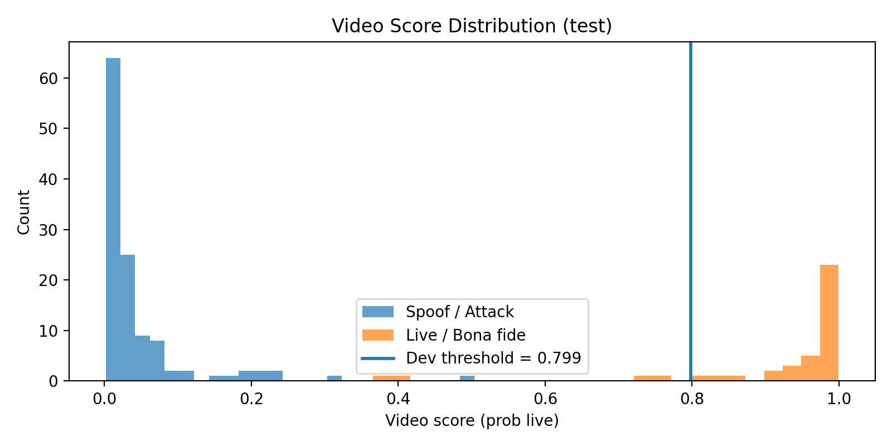

# End-to-End Face Presentation Attack Detection (PAD) on MSU-MFSD  
**RGB Baseline vs RGB + Laplacian “Frequency Cue” (MobileNetV2)**

This project builds a complete **Face Presentation Attack Detection (PAD)** pipeline that classifies a face **video** as either:
- **Live / Bona fide (1)**  
- **Spoof / Attack (0)**

We start from the **raw MSU-MFSD videos** and the provided **face bounding boxes**, extract and crop face frames, train a CNN, and finally evaluate using standard PAD metrics (**APCER / BPCER / ACER**) at the **video level** using a threshold chosen on the **dev** set.

---

## What is PAD and what are we proving?

A PAD system is a security layer used before face recognition / face unlock.  
It tries to prevent attacks like:
- printed photo in front of camera  
- replay attack using a screen  
- other presentation media

In PAD, **accuracy alone is not enough**. The key idea is that there are two different error types:

- **APCER** (security risk): attack incorrectly accepted as live  
- **BPCER** (usability risk): live incorrectly rejected as attack  
- **ACER = (APCER + BPCER)/2** summarizes both

So the “end result” of this project is:
1. we can train a model that produces a **live probability score** for frames/videos,  
2. aggregate frame scores to video scores,  
3. choose an operating threshold on dev (without touching test), and  
4. report PAD metrics on an unseen test set.

---

## Dataset: MSU-MFSD (Face Anti-Spoofing)

We use **MSU Mobile Face Spoofing Database (MSU-MFSD)**, which contains:
- videos of real users (**live / bona fide**)
- spoof videos (print / replay attacks)
- metadata including face bounding boxes

**Important:** This repo does not include dataset files. You must download MSU-MFSD separately.

---

## Pipeline Overview (End-to-End)

<p align="center">
  
</p>

### Step-by-step:

1. **Raw videos + metadata**
   - Input: `.mov/.mp4` videos + bounding boxes

2. **Decode videos → frames**
   - We handle occasional decode warnings / corrupted frames gracefully (skip bad frames)

3. **Face crop + resize**
   - Crop using bbox for each frame and resize to **224×224**

4. **Uniform sampling (K frames / video)**
   - We sample **K = 8** frames per video to reduce compute while covering time

5. **Two input variants**
   - **Branch A (Baseline):** RGB only (3 channels)
   - **Branch B (Proposed):** RGB + Laplacian channel (4 channels)

6. **CNN Model**
   - **MobileNetV2** backbone + binary classification head
   - Output: per-frame “probability of live”

7. **Frame scores → video score**
   - Video score = average of frame probabilities for that video

8. **Threshold selection on DEV**
   - Choose threshold using:
     - EER operating point
     - minimum-ACER threshold
     - APCER-constrained threshold (e.g., APCER ≤ 0.01)

9. **Final metrics on TEST**
   - Report APCER, BPCER, ACER, Accuracy

---

## Example Visuals

### Live vs Spoof frame examples
(These help show what the model sees.)

<p align="center">
  
  
</p>

### Frequency Cue (RGB + Laplacian)
We add a Laplacian map as a 4th channel to highlight high-frequency texture/edge artifacts
that often differ between real skin and spoof media.

<p align="center">
  
</p>

### Score histogram (test videos)
This plot is a strong “visual proof” that the model separates spoof vs live scores.

<p align="center">
  
</p>

---

## Data Splits: Train / Dev / Test (and what “dev” means)

- **Train:** used to learn model weights (backprop happens here)
- **Dev (development/validation):** used to tune decisions *without using test*
  - choose the best checkpoint
  - choose threshold (EER / min-ACER / APCER constraint)
- **Test:** final evaluation only (never used for tuning)

We use a **subject-disjoint protocol** to prevent identity leakage:
train identities ≠ dev identities ≠ test identities.

---

## Environment Setup

Recommended: Python 3.10+

Install dependencies:

```bash
python3 -m venv .venv
source .venv/bin/activate
pip install -U pip
pip install -r requirements.txt
